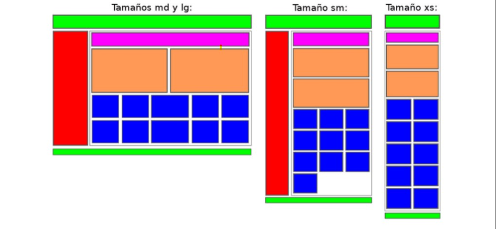

# DIW09_Layout_Bootstrap
Ejercicio FP DAW asignatura DIW - Crear una layout con Bootstrap

## Live Demo 🐱‍🏍

https://juan4dev.github.io/DIW09_Layout_Bootstrap/

* * *

### Enunciado 🔧

1. Crear una página web responsiva utilizando BootStrap. 
2. Las capas se distribuirán adaptándose a la resolución del dispositivo imitando los diseños
que se muestran a continuación. 
3. Tened en cuenta que la columna roja tendrá que desaparecer cuando el tamaño sea extra pequeño (xs).

## Autores ✒️

Juan Lopez
